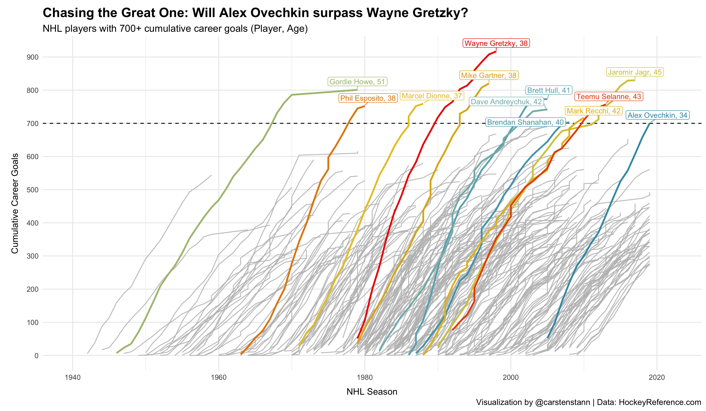
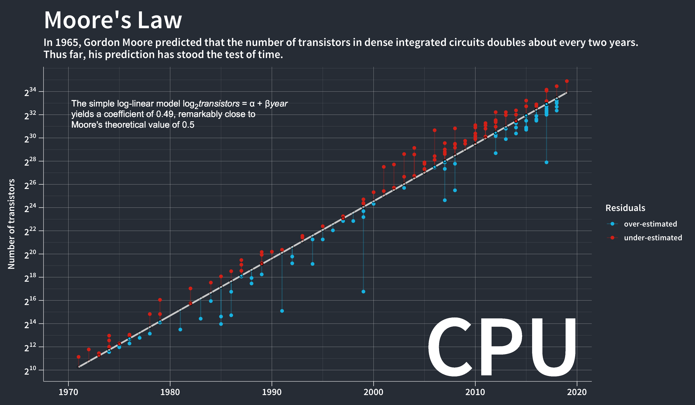
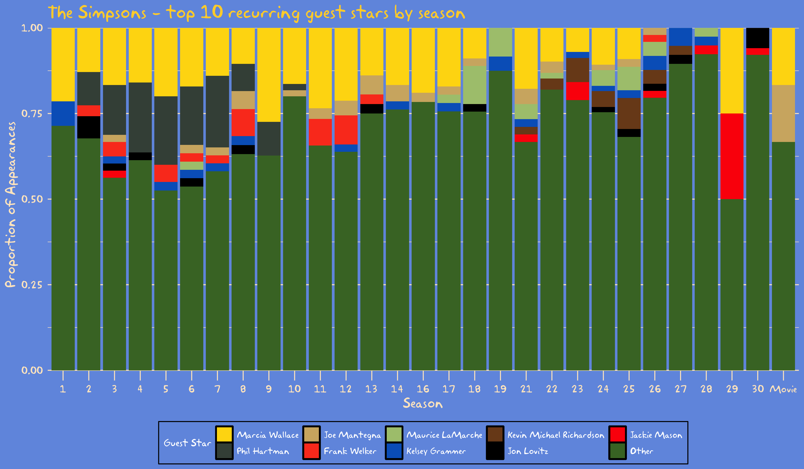
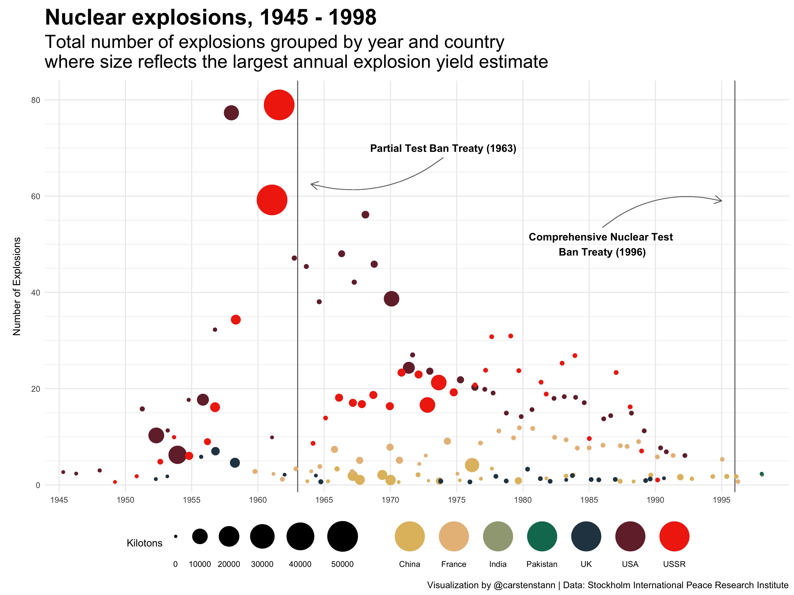
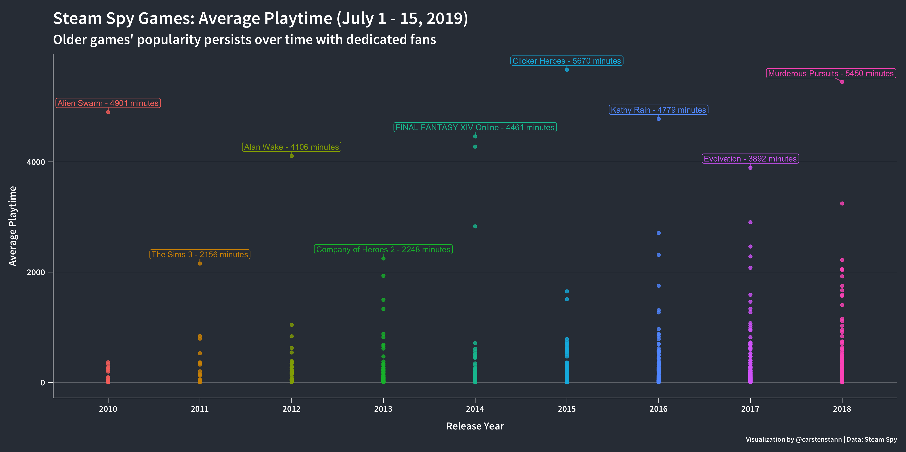
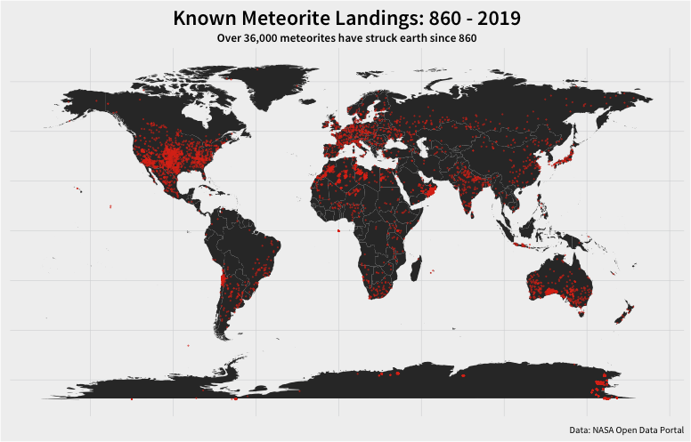
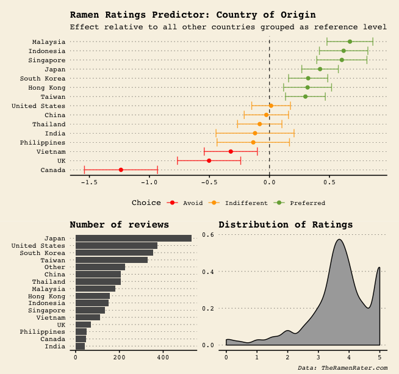
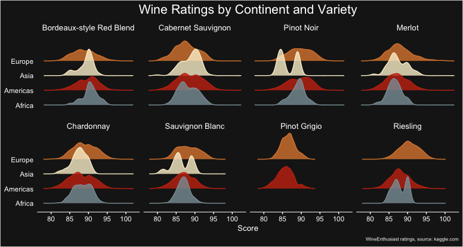
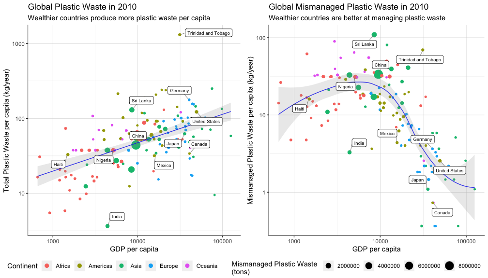

<h1 style="font-weight:normal" align="center">
  #TidyTuesday Challenge
</h1>

   :email: [Email](mailto:carsten.stann@gmail.com)
   :speech_balloon: [Twitter](https://twitter.com/carsten_stann)
   :camera: [Instagram](https://www.instagram.com/carsten.stann/)
   :necktie: [LinkedIn](https://www.linkedin.com/in/carsten-stann/)

#### [2020 Week 10](https://github.com/rfordatascience/tidytuesday/blob/master/data/2020/2020-03-03/readme.md) NHL Goals - Data via [HockeyReference.com](https://www.hockey-reference.com/leaders/goals_career.html) 

#### [2019 Week 36](https://github.com/rfordatascience/tidytuesday/tree/master/data/2019/2019-09-03) Moore's Law - Data Via [Wikipedia](https://en.wikipedia.org/wiki/Transistor_count) 

#### [2019 Week 35](https://github.com/rfordatascience/tidytuesday/tree/master/data/2019/2019-08-27) Simpsons Guest Stars - Data via [Wikipedia](https://en.wikipedia.org/wiki/List_of_The_Simpsons_guest_stars_(seasons_1%E2%80%9320))

#### [2019 Week 34](https://github.com/rfordatascience/tidytuesday/tree/master/data/2019/2019-08-20) Nuclear Explosions - Data via [SIPRI](https://github.com/data-is-plural/nuclear-explosions/blob/master/documents/sipri-report-original.pdf)

#### [2019 Week 31](https://github.com/rfordatascience/tidytuesday/tree/master/data/2019/2019-07-30) Video Games - Data via [Steam Spy](https://steamspy.com/year/)

#### [2019 Week 24](https://github.com/rfordatascience/tidytuesday/tree/master/data/2019/2019-06-11) Meteorite Strikes - Data via [NASA](https://data.nasa.gov/Space-Science/Meteorite-Landings/gh4g-9sfh/data)

#### [2019 Week 23](https://github.com/rfordatascience/tidytuesday/tree/master/data/2019/2019-06-04) Ramen Ratings - Data via [TheRamenRater.com](https://www.theramenrater.com/resources-2/the-list/)

#### [2019 Week 2](https://github.com/rfordatascience/tidytuesday/tree/master/data/2019/2019-05-28) Wine Ratings - Data via [Kaggle](https://www.kaggle.com/zynicide/wine-reviews)

#### [2019 Week 21](https://github.com/rfordatascience/tidytuesday/tree/master/data/2019/2019-05-21) Global Plastic Waste - Data via [Our World In Data](https://ourworldindata.org/plastic-pollution)

